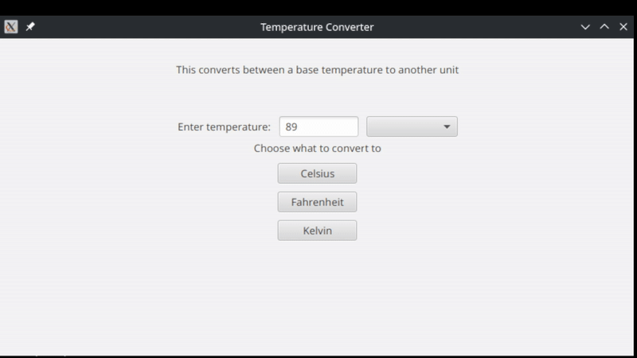

# convert-unit-temps.jar
convert-unit-temps.jar is a small GUI application that converts between three units: Kelvin, Fahrenheit, and Celsius using Java and JavaFX libraries.
## Running and dependencies
Make sure you are have Java and JavaFX SDK installed somewhere locally on your system
* [Java](https://www.oracle.com/java/technologies/downloads/)
* [JavaFX](https://gluonhq.com/products/javafx/)


Run it using:
```
java -jar --module-path $PATH_TO_FX --add-modules javafx.controls,javafx.fxml convert-unit-temps.jar
```
**or**
```
./run.sh
```
Make sure to change the `$PATH_TO_FX` in either the run command or in the bash file to point to the loaction of the extraced JavaFX SDK `/lib`.
